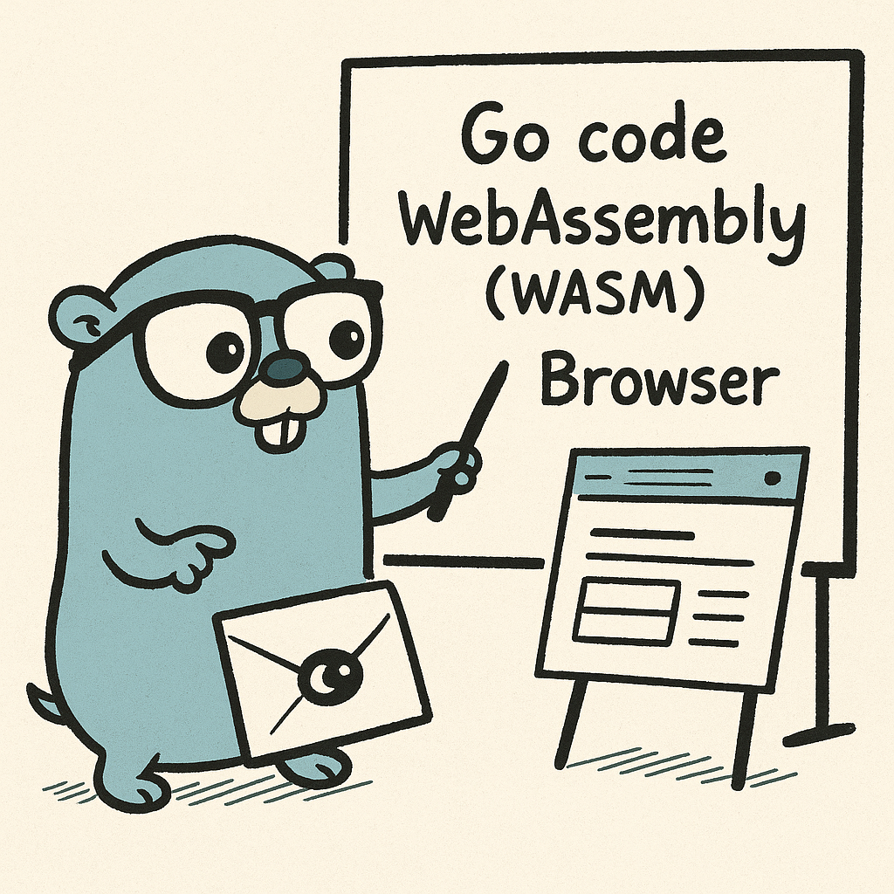

#   Go Finance WASM 🧮




Simulador de **financiamento imobiliário** onde:

- O **cálculo financeiro** (Tabela Price) é feito em **Go**  
- O Go é compilado para **WebAssembly**  
- O código roda **direto no navegador**, sem backend

O servidor em Go (`server.go`) serve apenas os arquivos estáticos (`index.html`, `main.wasm`, `wasm_exec.js`).  
Toda a matemática roda no **front-end**, via **WASM**.

---

## 🔍 O que o simulador faz

Dado:

- Valor do imóvel  
- Valor de entrada  
- Taxa de juros **ao ano (%)**  
- Prazo em **meses**

Ele calcula:

- **Valor financiado** = imóvel - entrada  
- **Parcela mensal** (Tabela Price)  
- **Total pago**  
- **Total de juros** pagos ao longo do financiamento

Fórmula usada (price):

- Valor financiado: `P = V - E`  
- Juros ao mês: `i = taxa_anual / 12 / 100`  
- Prazo em meses: `n`  

Parcela:

```text
PMT = P * i / (1 - (1 + i)^(-n))
```

Se `i = 0`, cai no caso simples: `P / n`.

---

## 🧠 Arquitetura (Go no front)

- `main.go`  
  Código Go compilado para WebAssembly.  
  Expõe uma função global JS: `calcFinance(propertyValue, downPayment, annualRate, months)`  
  que devolve um objeto com os resultados.

- `main.wasm`  
  Resultado da compilação de `main.go` com `GOOS=js` e `GOARCH=wasm`.  
  Esse arquivo é carregado no navegador e executado pelo runtime do Go.

- `wasm_exec.js`  
  Runtime oficial do Go para WebAssembly (vem do próprio Go em `GOROOT/lib/wasm/wasm_exec.js`).

- `index.html`  
  Front-end simples:
  - Formulário com os campos do simulador
  - JavaScript que chama `window.calcFinance(...)`
  - Exibe os resultados formatados em reais

- `server.go`  
  Servidor HTTP simples em Go para servir os arquivos estáticos na porta `9000`.

---

## ✅ Requisitos

- Go 1.20+ instalado (recomendado 1.21/1.22)
- Navegador moderno (Chrome, Edge, Firefox, etc.)

---

## 🚀 Como rodar o projeto

### 1. Clonar o repositório

```bash
git clone https://github.com/fabyo/go-finance-wasm.git
cd go-finance-wasm
```

### 2. Garantir o módulo Go

Se ainda não existir (caso você esteja começando do zero):

```bash
go mod init github.com/fabyo/go-finance-wasm
go mod tidy
```

> Se o `go.mod` já estiver no repositório, não precisa rodar o `go mod init`.

### 3. Obter o `wasm_exec.js` (se ainda não estiver no repo)

O runtime do Go para WASM vem com a própria instalação do Go.

No Windows / geral:

```bash
# Descobrir o GOROOT
go env GOROOT
```

Copia o arquivo:

```bash
# Exemplo de caminho
cp "$(go env GOROOT)/misc/wasm/wasm_exec.js" .
```

Ou copie manualmente de:

```text
<GOROOT>/misc/wasm/wasm_exec.js
```

para o diretório do projeto.

### 4. Compilar o Go para WebAssembly

```bash
# Dentro da pasta do projeto
# Modo WASM
set GOOS=js
set GOARCH=wasm
go build -o main.wasm main.go
```

No PowerShell:

```powershell
$env:GOOS="js"
$env:GOARCH="wasm"
go build -o main.wasm main.go
```

Depois de gerar o `main.wasm`, volte o ambiente ao normal (ou abra um novo terminal) para rodar o servidor.
- **Remove-Item Env:GOOS**
- **Remove-Item Env:GOARCH**
- **go env GOOS**
- **go env GOARCH**

---

### 5. Subir o servidor em Go

Em um terminal “normal” (sem `GOOS=js`, `GOARCH=wasm`):

```bash
go run server.go
```

Saída esperada:

```text
Servidor Go rodando em http://localhost:9000
```

---

### 6. Acessar no navegador

Abra:

```text
http://localhost:9000/index.html
```

Preencha:

- Valor do imóvel (ex.: `300000`)
- Entrada (ex.: `30000`)
- Juros ao ano (%) (ex.: `11`)
- Prazo (meses) (ex.: `360`)

Clique em **Simular**.

O fluxo será:

1. JS lê os valores do formulário
2. Chama `window.calcFinance(...)`
3. A função é executada em Go (rodando dentro do navegador via WebAssembly)
4. JS exibe os resultados na tela

Nenhum cálculo financeiro é feito no **backend**.

---

## 📁 Estrutura de arquivos (simplificada)

```text
go-finance-wasm/
├── go.mod
├── main.go       # código Go que vira WebAssembly
├── main.wasm     # build gerado
├── wasm_exec.js  # runtime Go para WASM
├── index.html    # front-end do simulador
└── server.go     # servidor HTTP em Go (porta 9000)
```
---

## 🔐 Observações

- Toda a lógica de financiamento roda **no client**, via **WebAssembly**:
  - Útil como demo de **“Go no front-end”**
- O servidor Go (`server.go`) é apenas estático:
  - Não processa formulário
  - Não faz cálculo
  - Só entrega os arquivos (`index.html`, `.wasm`, `.js`)
